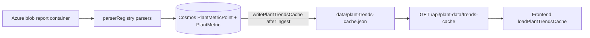

# QIPP Backend API

Express 5 API for QIPP operational data (roster, KPIs, PTW, ETL-backed plant metrics). Data is stored in Azure Cosmos DB (MongoDB API).

## Prerequisites

- Node.js 18+
- Azure Cosmos DB connection string
- SMTP credentials (for OTP and password reset emails)

## Setup

1. Clone the repository and install dependencies:

```bash
npm install
```

2. Copy environment template and configure:

```bash
cp .env.example .env
```

Required variables:

| Variable | Description |
|----------|-------------|
| `COSMOS_URI` | MongoDB connection string (Cosmos DB) |
| `JWT_SECRET` | Secret for signing JWTs (32+ chars recommended) |
| `PORT` | HTTP port (default `5000`) |
| `FRONTEND_URL` | Frontend origin for reset links and CORS |
| `SMTP_HOST`, `SMTP_PORT`, `SMTP_USER`, `SMTP_PASS` | Outbound email |
| `BLOB_SAS_URL` | Azure Blob SAS URL for storage account (container `report`) |
| `BLOB_CONTAINER_NAME` | Blob container name (default `report`) |
| `BLOB_STORAGE_ACCOUNT` | Storage account name (default `acwaopsqipp`) |

3. Start the server:

```bash
npm run dev    # development (nodemon)
npm start      # production
```

4. Health checks: `GET /health`, `GET /ready` (DB connectivity)

5. Legacy auth field migration (if upgrading an old database):

```bash
npm run migrate:auth
```

API contract with frontend: [docs/AUTH_CONTRACT.md](docs/AUTH_CONTRACT.md)

## Seeding (MongoDB Atlas / Render)

```bash
npm run seed:mongodb   # idempotent — roster, admin config, super admin, PTW (recommended for Atlas)
npm run seed           # legacy destructive seed (clears users/config/KPI)
npm run seed:ptw       # PTW personnel into AdminConfig
```

**Super administrator:** uses SMTP mailbox credentials when seeding:

```bash
npm run seed:mongodb
# or upsert only:
npm run seed:super-admin
```

See [docs/MIGRATION_RENDER.md](docs/MIGRATION_RENDER.md) for full Render + Atlas setup.

**Warning:** `npm run seed` (legacy) clears existing `AdminUser`, `AdminConfig`, and `PlantPerformance` data.



**Ingest triggers (all end in cache write):** startup ingest (`index.js`, skippable when cache present), 15‑min `ingestScheduler`, bi-hourly `ingestCron`, `POST /api/plant-data/ingest`, `POST /api/ingest/trigger`, `npm run ingest:local`.

**Hot path:** `GET /api/plant-data/trends-cache` reads the disk file only — no live Cosmos scan. Missing cache → `503` with a clear message. Admins may rebuild with `GET /api/plant-data/trends-cache?rebuild=1` and a Bearer token, or `npm run ingest:local -- --cache-only`.

**Plant ingest (Azure App Settings):** `PLANT_INGEST_MAX_AGE_DAYS=365`, `PLANT_INGEST_INTERVAL_MS=900000` (15 min), `PLANT_INGEST_ON_STARTUP=1`, `AZURE_STORAGE_CONNECTION_STRING` or `BLOB_SAS_URL`, `PLANT_INGEST_MAX_FILES=800`, `TREND_BACKFILL_MAX_DAYS=365`, `BLOB_DOWNLOAD_TIMEOUT_MS=120000`. After deploy, startup **skips** blob re-parse when the trends cache already has metrics/series; set `PLANT_INGEST_STARTUP_FORCE=1` to force re-parse, or `PLANT_INGEST_ON_STARTUP=0` to disable startup ingest (scheduler + cron still run).

**Azure trends cache (required on App Service):** `wwwroot` is read-only when `WEBSITE_RUN_FROM_PACKAGE=1`. Set **`PLANT_TRENDS_CACHE_DIR=/home/data`** in App Settings so ingest can write `plant-trends-cache.json`. On first start, the app copies the bundled `data/plant-trends-cache.json` from the zip into that directory if empty.

**Refresh cache when new Excel lands in blob:** run `npm run ingest:local` locally (or `--cache-only` if Cosmos is current), commit `data/plant-trends-cache.json`, push. On Azure, bi-hourly ingest cron updates Cosmos and rebuilds the writable cache file.

**Local ingest:** `cp .env.example .env`, set `COSMOS_URI`, then `npm run ingest:local`. `--force` re-parses all files; `--cache-only` rebuilds cache from Cosmos without re-parsing Excel. Parse-only (no DB): `node scripts/test-ingest-sample.js "C:\path\to\reports"`.

**Legacy:** `data/plant_data.json` is seed-only for `PlantPerformance` (`npm run seed`), not served to the trends UI. `GET /operational-overview` and `GET /chemistry-water-overview` remain for backward compatibility; the frontend reads chemistry via `chemistryWater` inside the trends cache.

**Shift highlight remark filters:** `services/plantReports/opsHighlightFilter.js` rejects date-only strings, label-only lines (e.g. `CRBS Status:`), generic phrases (`all are in service`, etc.), and remarks without substantive content (15+ chars or action verbs). Filters apply on ingest; existing bad rows in Cosmos are not deleted automatically — they refresh on the next ingest pass for matching source files, or run `npm run ingest:local -- --force` to re-process reports. Optional blocklist: `OPS_HIGHLIGHT_BLOCKLIST=phrase one,phrase two`.

**Azure deploy (GitHub Actions):** `.github/workflows/main_qipp-api.yml` builds with `npm ci`, runs tests, reinstalls prod-only deps, zips a lean package (includes `data/plant-trends-cache.json`; excludes tests/docs/dev deps), stops the app, deploys via `az webapp deploy` with retries, sets `WEBSITE_RUN_FROM_PACKAGE=1` and `SCM_DO_BUILD_DURING_DEPLOYMENT=false`, then waits on `/health`.

**Warning:** `npm run seed` clears existing `AdminUser`, `AdminConfig`, and `PlantPerformance` data.

Default seeded passwords are defined in `seed.js` only — they are not printed to the console. Change them immediately in non-local environments.

## Authentication flow

1. `POST /api/auth/register` — creates account with `accessRole: viewer` (role cannot be set by client)
2. `POST /api/auth/verify-otp` — verifies email via OTP
3. Admin approves user via `PUT /api/admin/users/:id/approve`
4. `POST /api/auth/login` — returns JWT (requires verified email + approval)
5. `GET /api/auth/verify` — validates token (send `Authorization: Bearer <token>`)

Most operational routes require a valid JWT. **Public (no auth):** `/health`, `GET /api/plant-data/metrics/date-range`, `GET /api/plant-data/trends-cache`, legacy `GET /api/plant-data/operational-overview`.

## Python ETL

```bash
cd etl
pip install -r requirements.txt
export COSMOS_MONGO_URI="<same as COSMOS_URI>"
python run_all_etl.py
```

Collection field names and API mapping: see [docs/ETL_SCHEMAS.md](docs/ETL_SCHEMAS.md).

## Tests

```bash
npm test
```

## Deploy

Production runs on Azure App Service (`qipp-api`). GitHub Actions workflow: `.github/workflows/main_qipp-api.yml` (push to `main` or manual dispatch).

**GitHub Actions secrets** (Settings → Secrets and variables → Actions):

| Secret | Purpose |
|--------|---------|
| `AZUREAPPSERVICE_CLIENTID_*` | Service principal client ID (from Azure → Deployment Center → GitHub) |
| `AZUREAPPSERVICE_TENANTID_*` | Azure AD tenant ID |
| `AZUREAPPSERVICE_SUBSCRIPTIONID_*` | Azure subscription ID |
| `AZURE_RESOURCE_GROUP` | *(optional)* Resource group name if auto-resolve fails |

OIDC federated login is used (`azure/login@v2`); a legacy `AZURE_CREDENTIALS` JSON secret is **not** required when the three `AZUREAPPSERVICE_*` secrets above exist.

The workflow builds a lean zip (production `node_modules` only, no tests/docs/etl/scripts), sets `WEBSITE_RUN_FROM_PACKAGE=1`, stops the app during deploy, uses `az webapp deploy --async true` with Kudu polling (30 min timeout), then restarts the app. Target zip size: **&lt;30 MB**; hard fail if **&gt;100 MB**.

Set runtime secrets in Azure **App Settings** (never commit `.env`). Configure CORS via `FRONTEND_URL` (defaults include `https://qippop.azurewebsites.net` and `http://localhost:3000`).

If deploys fail with 504: restart `qipp-api` in Azure Portal, disable any duplicate Azure DevOps deployment pipeline, verify App Service Plan tier / Kudu disk quota, then re-run the workflow.

## Security notes

- Rotate any credentials that were ever committed to git
- Use strong `JWT_SECRET` in production
- Rate limits apply to `/api/auth/*` and `POST /api/admin/check-pin`

## Architecture notes

- Shared API response helper: `utils/apiResponse.js` (`{ success, data }` / `{ success: false, message }`)
- Long-term: split `AdminUser` auth from roster HR records; optional httpOnly cookies via Next.js BFF (see [docs/AUTH_CONTRACT.md](docs/AUTH_CONTRACT.md))
